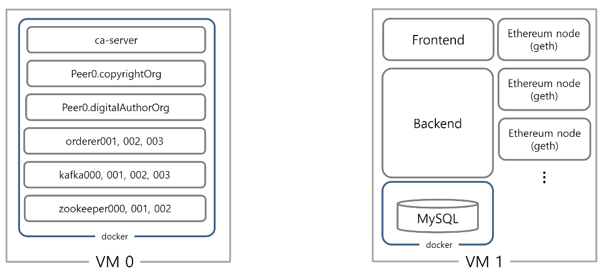

# 이미지 저작권 P2P 경매 사이트

윈도우 XP의 공식 배경화면으로 유명한 언덕사진을 찍은 사진작가는 세계에서 2번째로 많은 저작권료를 받고 있습니다. 핸드폰으로 사진작가 못지 않은 퀄리티를 내는 요즘, 찍은 사진들의 저작권을 쉽게 사고팔면 어떨까? 하는 생각을 바탕으로 저작권을 쉽고 안전하게 거래 할 수 있는 사이트를 개발하였습니다.
<br>
[](https://youtu.be/p6_8xIwxEEc?t=0s) 

### 블록체인 
> 신뢰를 만드는 기술
>
블록체인은 이전 블록에 대한 해시를 다음 블록에 기입해 계속 이어지도록 체인을 만드는 기술이다. 이전 블록에서 거래 내역을 수정하거나 조작하면 일단 해당 해시가 변경된다. 그렇기 때문에 조작한 내역을 숨기려면 이전블록 뿐만 아니라 이전블록 앞의 연결된 모든 블록들을 변경해야만 한다. 따라서 악의를 가지고 데이터를 마음대로 바꾸는 것은 불가능하다. 이러한 블록체인의 특징을 이용해서 이미지에 대한 저작권을 블록체인에 기록하여 신뢰성을 가진 정보를 제공할 수 있다.

### 블록체인 활용
#### 1. Public BlockChain (이더리움)
<u>`경매기능`</u>은 이더리움 `스마트 컨트랙트`를 통해 직접 진행됩니다. 이때 이더리움 네트워크 상에 작성한 스마트 컨트랙트가 사용되며 `이더리움 네트워크`의 통화인 이더(Eth)가 매개가 됩니다.<br>

* Remix에서 Solidity 언어로 작성한 [smartContract].sol 파일을 컴파일한다.
* ABI, binaryCode, address를 가지고 wrapper class로 변환 하면 java로 사용 가능
* 얻은 ABI 및 address로 haribo-frontend/components/constants.js에서 초기화
* 스마트컨트랙트를 wrapper class로 변환한 파일을 가지고 Spring boot에서 사용
* [wrapper class 변환](https://web3j.readthedocs.io/en/latest/command_line_tools.html) (변환 시 web3j 파일이 필요하다면 docs/web3j에 포함)
* [wrapper class 사용시 이해](https://medium.com/day34/klaytn-caver-java-3-%EC%8A%A4%EB%A7%88%ED%8A%B8-%EC%BB%A8%ED%8A%B8%EB%9E%99%ED%8A%B8-%EB%B0%B0%ED%8F%AC%EC%99%80-%EC%8B%A4%ED%96%89-19630316d36)

##### 스마트컨트랙트
```pragma solidity ^0.4.24;

/**
 * @title Ownable
 * @dev The Ownable contract has an owner address, and provides basic authorization control
 * functions, this simplifies the implementation of "user permissions".
 */
contract Ownable {
  address public owner;

  event OwnershipTransferred(address indexed previousOwner, address indexed newOwner);

  /**
   * @dev The Ownable constructor sets the original `owner` of the contract to the sender
   * account.
   */
  constructor() public {
    owner = msg.sender;
  }


  /**
   * @dev Throws if called by any account other than the owner.
   */
  modifier onlyOwner() {
    require(msg.sender == owner);
    _;
  }


  /**
   * @dev Allows the current owner to transfer control of the contract to a newOwner.
   * @param newOwner The address to transfer ownership to.
   */
  function transferOwnership(address newOwner) public onlyOwner {
    require(newOwner != address(0));
    emit OwnershipTransferred(owner, newOwner);
    owner = newOwner;
  }

}

contract AuctionFactory is Ownable {

    address[] public auctions;

    event AuctionCreated(address auctionContract, address owner, uint numAuctions, address[] allAuctions);
    event NewAuction(address auctionContract, address owner, uint workId, uint minValue, uint startTime, uint endTime);

    constructor() public {
    }

    function createAuction(uint workId, uint minValue,  uint startTime, uint endTime) public returns (address){
        Auction newAuction = new Auction(msg.sender, workId, minValue, startTime, endTime);
        auctions.push(newAuction);
        emit NewAuction(newAuction, msg.sender, workId, minValue, startTime, endTime);
        return newAuction;
        //AuctionCreated(newAuction, msg.sender, auctions.length, auctions);
    }

    function allAuctions() public constant returns (address[]) {
        return auctions;
    }
}

contract Auction {

  // 생성자에 의해 정해지는 값
  address public owner;
  uint public auctionStartTime;
  uint public auctionEndTime;
  uint public minValue;
  uint public digitalWorkId;

  // 현재 최고 입찰 상태
  address public highestBidder;
  uint public highestBid;

  mapping(address => uint) pendingReturns;
  address[] bidders;

  bool public ended;

  event HighestBidIncereased(address bidder, uint amount);
  event AuctionEnded(address winner, uint amount);

  constructor(address _owner, uint workId, uint minimum, uint startTime, uint endTime) public {
      require(minimum > 0);
      digitalWorkId = workId;
      minValue = minimum * 1 ether;
      owner = _owner;
      auctionStartTime = startTime;
      auctionEndTime = endTime;
  }

  function bid() public payable
  onlyNotOwner
  onlyBeforeEnd
  onlyHigherThanMinValue
  onlyHigherThanCurrentHighest{

      if(highestBid > 0) {
        pendingReturns[highestBidder] += highestBid;
      }

      highestBid = msg.value;
      highestBidder = msg.sender;
      bidders.push(msg.sender);

      emit HighestBidIncereased(msg.sender, msg.value);
  }

  function getTimeLeft() public view returns (uint) {
      return (auctionEndTime - now);
  }

  function getPendingReturnsBy(address _address) view public returns (uint){
      return pendingReturns[_address];
  }

  function getAuctionInfo() view public returns (uint, uint, uint, uint, address, uint, bool){
      return (auctionStartTime, auctionEndTime, minValue, digitalWorkId, highestBidder, highestBid, ended);
  }

  function withdraw() public onlyBidder returns (bool) {

      uint amount = pendingReturns[msg.sender];

      if(!msg.sender.send(amount)){
          pendingReturns[msg.sender] = amount;
          return false;
      }
      pendingReturns[msg.sender] = 0;
      return true;
  }

  function endAuction() public
  onlyOwner
  onlyBeforeEnd{
    _end();
    _refund(false);
    owner.transfer(highestBid);

    emit AuctionEnded(highestBidder, highestBid);
  }

  function cancelAuction() public
  onlyOwner
  onlyBeforeEnd{
    _end();
    _refund(true);
  }

  function _end() internal{
      ended = true;
  }

  function _refund(bool isCancelled) internal {
      uint returnToHighestBidder;
      if(isCancelled){
        returnToHighestBidder = pendingReturns[highestBidder] + highestBid;
      } else {
        returnToHighestBidder = pendingReturns[highestBidder];
      }

      for(uint i = 0; i < bidders.length; i++){
        address bidder = bidders[i];
        if(bidder != highestBidder){
            if(!bidder.send(pendingReturns[bidder])){
                revert();
            }
        } else {
            if(!bidder.send(returnToHighestBidder)){
                revert();
            }
        }
      }
  }

  modifier onlyOwner {
    require(msg.sender == owner);
    _;
  }

  modifier onlyNotOwner {
    require(msg.sender != owner);
    _;
  }

  modifier onlyAfterStart {
    require(now >= auctionStartTime);
    _;
  }

  modifier onlyBeforeEnd {
    require(now < auctionEndTime && !ended);
    _;
  }

  modifier onlyHigherThanMinValue{
     require(msg.value >= minValue);
    _;
  }

  modifier onlyHigherThanCurrentHighest {
    require(msg.value > highestBid);
    _;
  }

  modifier onlyBidder {
    require(pendingReturns[msg.sender] != 0);
    _;
  }
}
```
<br>
#### 2. Private BlockChain (Hyperledger Fabric)
이미지의 <u>`저작권`</u>은 프라이빗 혹은 허가형 블록체인의 대표인 `하이퍼레저 패브릭`에 기록하는 기능을 지닙니다. 시스템을 통한 작품 등록, 삭제, 경매 완료 등 소유권에 변경이 발생하는 이벤트가 있을 때 [체인코드](https://miiingo.tistory.com/105?category=644184)를 호출하여 소유권 이력을 기록하게 합니다. 
* [체인코드를 Fabric-sdk-java를 이용해서 채널 연동 및 사용법 (1)](https://medium.com/@lkolisko/hyperledger-fabric-sdk-java-basics-tutorial-a67b2b898410)
* [체인코드를 Fabric-sdk-java를 이용해서 채널 연동 및 사용법 (2)](https://cyberx.tistory.com/191)
* haribo-frontend/components/auctionFactory.js

```js
const shim = require('fabric-shim');


var Chaincode = class {
    /**
     * Chaincode Instantiation method.
     * @param {Object} stub
     * @return {SuccessResponse} shim.success() returns a standard response object with status code 200 and an optional payload.
     */
    async Init(stub){
        console.info('Instantiated completed');
        return shim.success();
    }

    /**
     * Chaincode Invoking method.
     * @param {Object} stub The chaincode object
     * @return {SuccessResponse} status code and optional payload
     */
    async Invoke(stub){

       /** Get method name and parameter from the chaincode arguments */
       let ret = stub.getFunctionAndParameters();
       let method = this[ret.fcn];

       /** Undefined method calling exception(but do not throw error) */
       if(!method){
           console.log('Method name [' + ret.fcn + '] is not defined');
           return shim.success();
       }

       /** Method call */
       try{
           let payload = await method(stub, ret.params);
           return shim.success(payload);

       }catch(err){
           console.log(err);
           return shim.error(err);
       }
    }


    /**
     * Regist digital asset information
     * Mandatory requirement: Create a composite key for state recording.
     * Composite key structure: Asset.assetID
     * @param {Object} stub
     * @param {string[]} args args[0]: assetID, args[1]: owner
     */
    async registerAsset(stub, args){

        /** Inappropriate argument exception */
        if(args.length != 2){
            throw new Error('Incorrect number of arguments. Expecting 2, but received '+ args.length);
        }

        /** !!! Generate composite key !!! */
        let compositeKey = stub.createCompositeKey("Asset.", [args[0]]);

        /** Duplicated asset checking */
        let dupCheck = await stub.getState(compositeKey);

        var isExist = function(value){
            if(value == "" || value == null || value == undefined ||
            (value != null && typeof value =="object" && !Object.keys(value).length)){
                return true;
            }

            else{
                return false;
            }
        };

        if(isExist(dupCheck) != true){
            throw new Error('AssetID ' + compositeKey + 'is already registered.');
        }

        /** Consist asset information structure */
        var assetInfo = {
          assetID: args[0],
          owner: args[1],
          createdAt: 'FALSE',
          expiredAt: 'FALSE'
        };

        /** Put the asset information */
        await stub.putState(compositeKey, Buffer.from(JSON.stringify(assetInfo)));

    }

    /**
     * Confirm timestamp which is asset registeration time.
     * @param {Object} stub
     * @param {string[]} args args[0]: assetID
     */
    async confirmTimestamp(stub, args){ //assetID에 대한 소유권 등록 시점 기록
        /** Inappropriate argument exception */
        if(args.length != 1){
            throw new Error('Incorrect number of arguments. Expecting assetID as an argument');
        }

        /** !!! Generate composite key !!! */
        let searchKey = stub.createCompositeKey("Asset.", [args[0]]);

        /** Get state of asset information */
        let asset = await stub.getState(searchKey);
        let assetInfo = JSON.parse(asset);

        /** Get transaction timestampe using 'stub' */
        let txTimestamp = stub.getTxTimestamp();

        /** Timestamp formatting 'YYYY-MM-DD HH:MM:SS' */
        let timestampString;
        let tsSec = txTimestamp.seconds;
        let tsSecValue = tsSec.low;
        let dataTimeObj = new Date(tsSecValue*1000);

        timestampString = dataTimeObj.getFullYear() + '-' + ('0' + (dataTimeObj.getMonth() + 1)).slice(-2) +'-'
                        +('0'+dataTimeObj.getDate()).slice(-2)+' '+ (dataTimeObj.getHours() + 9) +':'+('0'+dataTimeObj.getMinutes()).slice(-2)+ ':'+dataTimeObj.getSeconds();


        /** Modify asset's createAt field */
        assetInfo.createdAt = timestampString;

        /** Put the modified asset information */
        await stub.putState(searchKey, Buffer.from(JSON.stringify(assetInfo)));

    }

    /**
     * Get digital asset information.
     * @param {Object} stub
     * @param {string[]} args args[0]: assetID
     * @return {string} The asset information of assetID
     */
    async query(stub, args){

        /** !!! Generate composite key !!! */
        let searchKey = stub.createCompositeKey("Asset.", [args[0]]);

        /** Get state */
        let asset = await stub.getState(searchKey);

        /** Return asset state */
        return asset;
    }


    /**
     * Get asset's history of state
     * @param {Object} stub
     * @param {string[]} args args[0]: assetID
     * @return {string} The history of asset
     */
    async getAssetHistory(stub, args){
        // 적절하지 않은 인자가 들어왔을 때
        if(args.length != 1){
            throw new Error('Incorrect number of arguments. Expecting assetID as an argument');
        }
      
        // Generate composite key
        let searchKey = stub.createCompositeKey("Asset.", [args[0]]);

        // Get the history of state 
        var historyIter = await stub.getHistoryForKey(searchKey);

        // Copy the history to array and parse to string
        let results = [];
        let res = {done : false};
    
        while(!res.done){
            res = await historyIter.next();
            try{
                if(res && res.value && res.value.value){
                    let val = res.value.value.toString('utf8');
        
                    if(val.length > 0){
                        results.push(JSON.parse(val));
                    }
                }
            }catch(err){
                console.info(err);
            }
            if(res && res.done){
                try{
                    historyIter.close();
                }catch(err){
                    console.info(err);
                }
            }
        }

        // Return the history as string
        return Buffer.from(JSON.stringify(results));
    }

    /**
     * Record expiration time of current owner's ownership
     * @param {Object} stub
     * @param {string[]} args args[0]: assetID, args[1]: current owner
     */
    async expireAssetOwnership(stub, args){
		// 적절하지 않은 인자가 들어왔을 때
        if(args.length != 2){
            throw new Error('Incorrect number of arguments. Expecting 2, but received' + args.length);
        }

        // Generate composite key !!!
        let searchKey = stub.createCompositeKey("Asset.", [args[0]]);
        
        // asset정보 가져오기
        let asset = await stub.getState(searchKey);
        let assetInfo = JSON.parse(asset);        

    	// 현재 asset의 소유권 확인, owner만이 기록할 수 있도록
        if(args[1] != assetInfo.owner){
            throw new Error('Expire ownership operation is allowed to only current owner');
        }
        else{

        	// timestamp 등록
            let txTimestamp = stub.getTxTimestamp();
            let timestampString;
    
            let tsSec = txTimestamp.seconds;
            let tsSecValue = tsSec.low;
            
            let dataTimeObj = new Date(tsSecValue * 1000);
        	// timestamp formatting
            timestampString = dataTimeObj.getFullYear() + '-' + ('0' + (dataTimeObj.getMonth() + 1)).slice(-2) +'-' 
                            +('0'+dataTimeObj.getDate()).slice(-2)+' '+ (dataTimeObj.getHours() + 9) +':'
                            +('0'+dataTimeObj.getMinutes()).slice(-2)+ ':'+('0'+dataTimeObj.getSeconds()).slice(-2);
    
        	// expiredAt 필드 업데이트
            assetInfo.expiredAt = timestampString;
    
        	// Put state
            await stub.putState(searchKey, Buffer.from(JSON.stringify(assetInfo)));
        }
       
    }

    /**
     * Update asset's ownership and its operation time
     * @param {Object} stub
     * @param {string[]} args args[0]: assetID, args[1]: new owner
     */
    async updateAssetOwnership(stub, args){
		// 적절하지 않은 인자가 들어왔을 때
        if(args.length != 2){
            throw new Error('Incorrect number of arguments. Expecting 2, but received' + args.length);
        }

        // Generate composite key
        let searchKey = stub.createCompositeKey("Asset.", [args[0]]);
        
        // asset에 대한 상태정보 가져오기
        let updatedAsset = await stub.getState(searchKey);
        let updatedAssetInfo = JSON.parse(updatedAsset);
    
        // stub를 사용해서 트랜잭션 타임스탬프 가져오기
        let txTimestamp = stub.getTxTimestamp();
        let timestampString;

        let tsSec = txTimestamp.seconds;
        let tsSecValue = tsSec.low;
        
        let dataTimeObj = new Date(tsSecValue*1000);

        // 타임스탬프 포매팅 'YYY-MM-DD HH:MM:SS'
        timestampString = dataTimeObj.getFullYear() + '-' + ('0' + (dataTimeObj.getMonth() + 1)).slice(-2) +'-' 
                        +('0'+dataTimeObj.getDate()).slice(-2)+' '+ (dataTimeObj.getHours() + 9) +':'+('0'+dataTimeObj.getMinutes()).slice(-2)+ ':'+dataTimeObj.getSeconds();

        // asset정보 업데이트 : owner, createdAt, expiredAt
        updatedAssetInfo.owner = args[1];
        updatedAssetInfo.createdAt = timestampString;
        updatedAssetInfo.expiredAt = 'FALSE'
    
        // Put the udpated asset information
        await stub.putState(searchKey, Buffer.from(JSON.stringify(updatedAssetInfo)));
    }
};

/** Start chaincode */
shim.start(new Chaincode());

```


### 네트워크 구성


> - haribo-backend/src/main/resources/application.properties 에 환경설정 및 변수들이 초기화 되어있다.
> - haribo-frontend/component/constants.js 에서 URL 수정
> - docs/SETTING 에 Front-End, Back-End, DB, Ethereum, Hyperledger Fabric 설정 관련 파일 포함.


